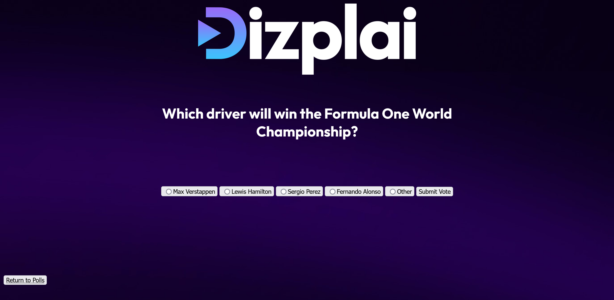
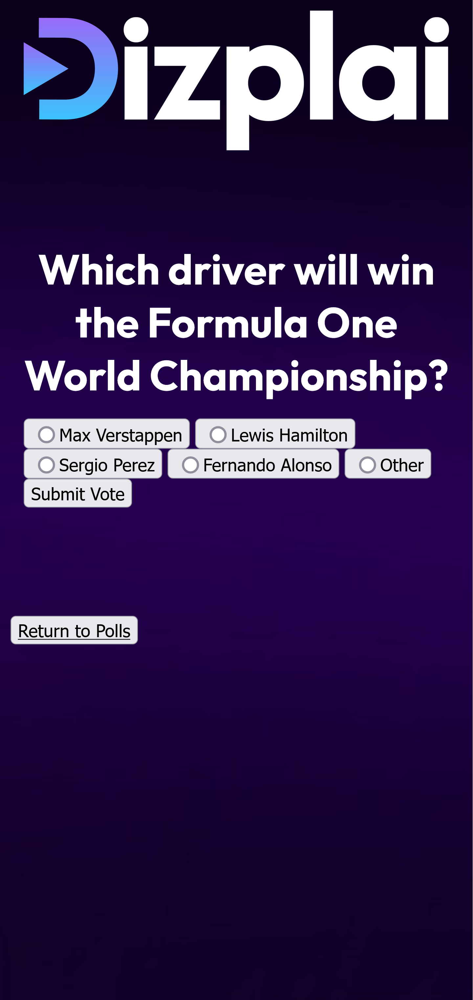
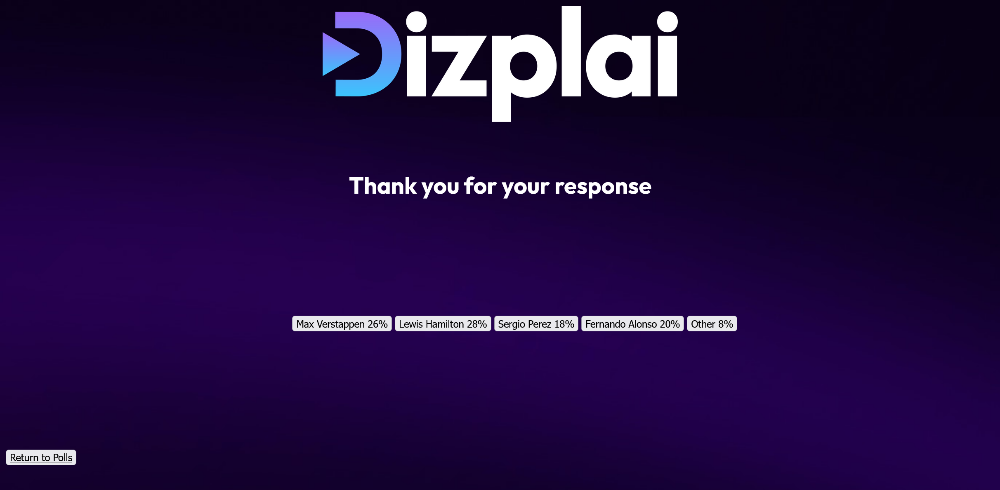
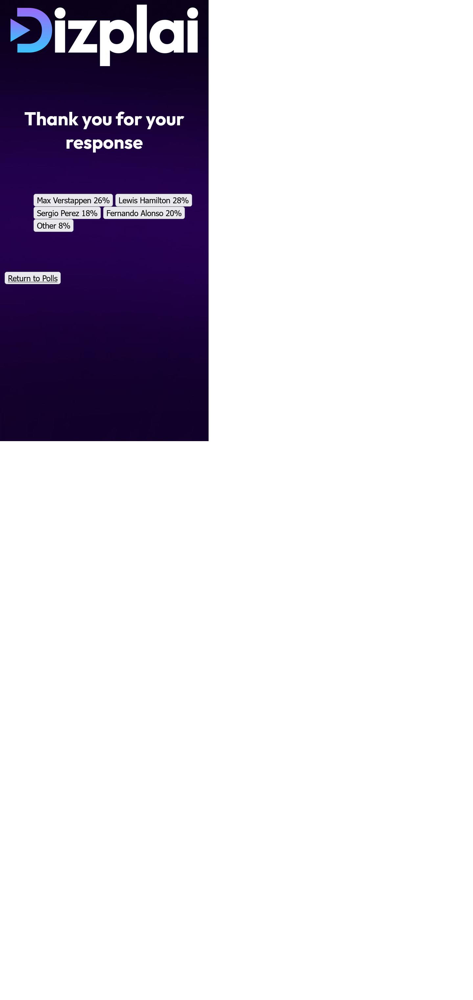

# Small Polling Web App for Dizplai Technical Test

## Instructions

This project requires the [node.js](https://nodejs.org/en) runtime environmnent.

It is built with the [express](https://expressjs.com/) web framework which has installation instructions [here](https://expressjs.com/en/starter/installing.html).

To launch the web app, making it available at localhost:3000, run:
> node app.js

## Missing/ Unfinished Requirements

The following could not be completed due to time constraints:

- Sorting poll results in descending order
- End to end tests using the Selenium web driver.
- Styling, notably:
    - The voting option buttons
    - Return to Home button
    - Layout and usability on mobile (especially the size of option buttons and the gap between them)

## Showcase

### Home Page
 

## Voting Page

 

## Results Page

 

